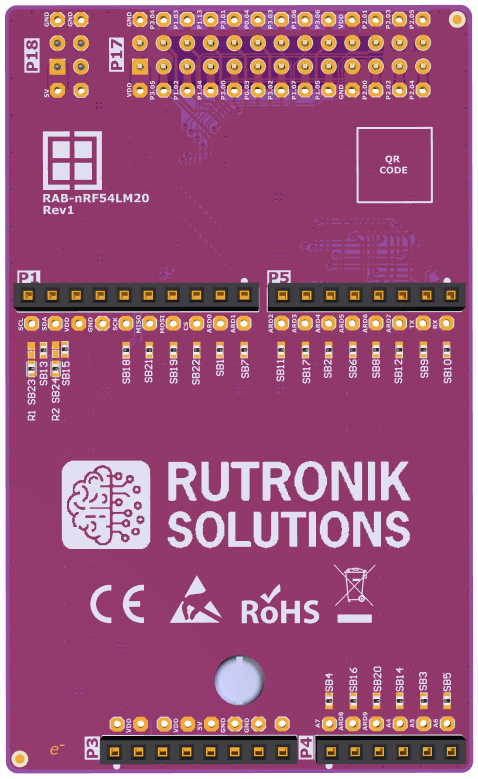

# RAB-nRF54LM20 Hardware Design Files

This simple but useful adapter board lets you use the nRF54LM20-DK development kit from Nordic Semiconductor with almost all Rutronik System Solutions adapter boards.

Here you may find hardware documents as follows:

- Schematics, PCB layout, and mechanical drawings.
- BOM: Bill of Materials.
- Assembly drawings.
- Altium Designer Project.
- Gerber, STEP and PARASOLID files.

## Legal Disclaimer

The evaluation board including the software is for testing purposes only and, because it has limited functions and limited resilience, is not suitable for permanent use under real conditions. If the evaluation board is nevertheless used under real conditions, this is done at one’s responsibility; any liability of Rutronik is insofar excluded. 

